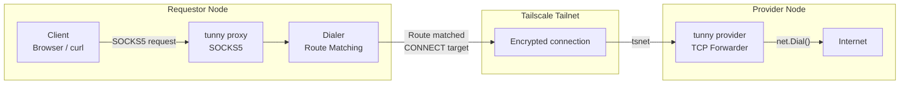
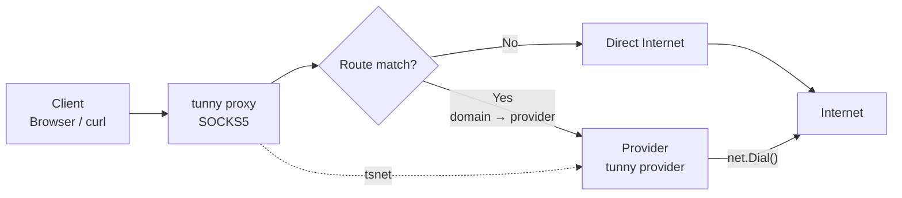
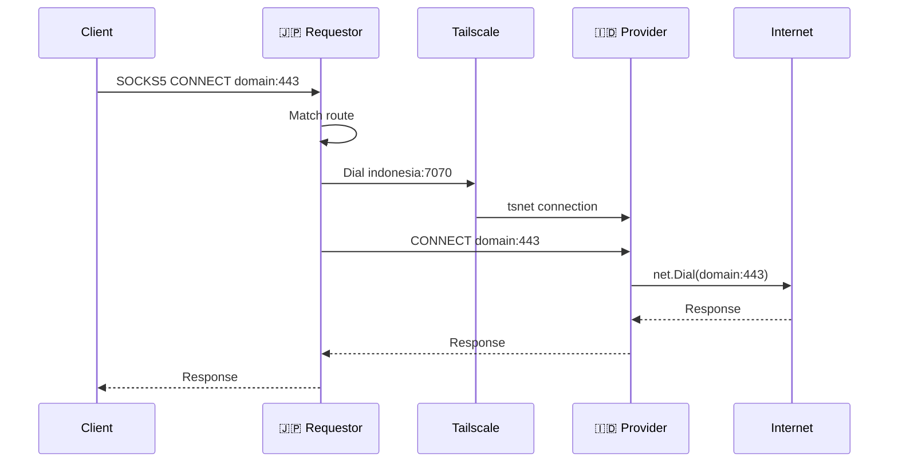
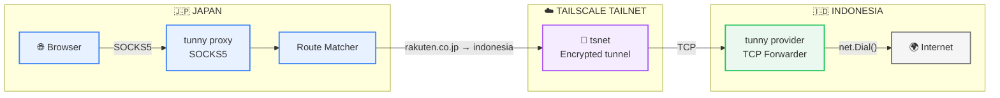

# tunny
Location-aware network tunneling for routing traffic through trusted nodes.

# How it works
Basically it's only proxying the request to provider (node - node) by translatin the host using Tailscale network

See the diagrams below



# Flowchart


# Sequence Diagram


# Network Topology


```topojson
{
  "type": "Topology",
  "objects": {
    "routes": {
      "type": "GeometryCollection",
      "geometries": [
        {
          "type": "LineString",
          "properties": {
            "name": "tunny tunnel",
            "from": "Japan",
            "to": "Indonesia"
          },
          "arcs": [0]
        }
      ]
    },
    "nodes": {
      "type": "GeometryCollection",
      "geometries": [
        {
          "type": "Point",
          "properties": {
            "name": "Japan",
            "role": "Requestor"
          },
          "coordinates": [139.6917, 35.6895]
        },
        {
          "type": "Point",
          "properties": {
            "name": "Indonesia",
            "role": "Provider"
          },
          "coordinates": [106.8456, -6.2088]
        }
      ]
    }
  },
  "arcs": [
    [
      [139.6917, 35.6895],
      [135, 28],
      [125, 18],
      [115, 8],
      [106.8456, -6.2088]
    ]
  ]
}
```