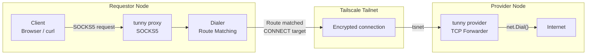
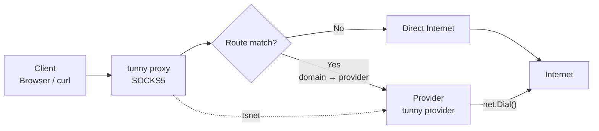
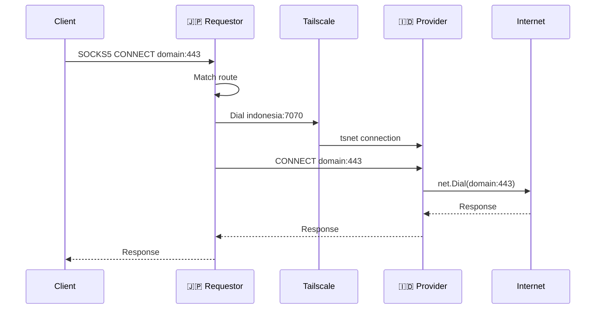
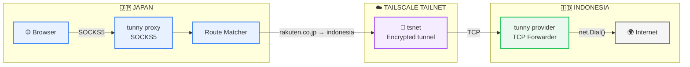

# tunny
Location-aware network tunneling for routing traffic through trusted nodes.

# How it works
Basically it's only proxying the request to provider (node - node) by translatin the host using Tailscale or Direct network

- The client sends traffic to the tunny tunnel or SOCKS5 proxy.
- Tunny checks whether the destination matches a configured route.
- Unmatched traffic uses the normal internet connection.
- Matched traffic is sent to the selected provider node.
- The provider connects to the destination and forwards the response back.
- Providers can connect through Tailscale or a direct network connection.

## Components

### Tunnel

The tunnel creates a local TUN interface. It catches traffic for configured
routes and forwards it to the selected provider.

See the [tunnel and provider example](example/tunnel-provider/README.md).

### Provider

The provider listens for connections from a tunnel or proxy. It connects to
the requested destination and sends data between the client and the internet.

### Proxy

The proxy is a local SOCKS5 server. Applications can use it when they do not
need a system-wide TUN interface.

See the [proxy and provider example](example/proxy-provider/README.md).

## Control plane and data plane

### Control plane (WIP)

The control plane decides how traffic should be handled. In Tunny, this is
the configuration that defines:

- Node names and network transport.
- Provider addresses.
- Hostname to provider routes.
- Tunnel, proxy, and provider listening settings.

The route table uses this information to choose a provider before a
connection is opened.

### Data plane

The data plane carries the actual traffic. It starts after a route has been
selected:

- The tunnel reads packets from the TUN interface.
- The proxy or tunnel opens a connection to the selected provider.
- The provider connects to the destination service.
- Request and response data are copied between the client and destination.

The control plane chooses the path. The data plane moves the bytes along that
path.

See the diagrams below



# Flowchart


# Sequence Diagram


# Network Topology


```topojson
{
  "type": "Topology",
  "objects": {
    "routes": {
      "type": "GeometryCollection",
      "geometries": [
        {
          "type": "LineString",
          "properties": {
            "name": "tunny tunnel",
            "from": "Japan",
            "to": "Indonesia"
          },
          "arcs": [0]
        }
      ]
    },
    "nodes": {
      "type": "GeometryCollection",
      "geometries": [
        {
          "type": "Point",
          "properties": {
            "name": "Japan",
            "role": "Requestor"
          },
          "coordinates": [139.6917, 35.6895]
        },
        {
          "type": "Point",
          "properties": {
            "name": "Indonesia",
            "role": "Provider"
          },
          "coordinates": [106.8456, -6.2088]
        }
      ]
    }
  },
  "arcs": [
    [
      [139.6917, 35.6895],
      [135, 28],
      [125, 18],
      [115, 8],
      [106.8456, -6.2088]
    ]
  ]
}
```
