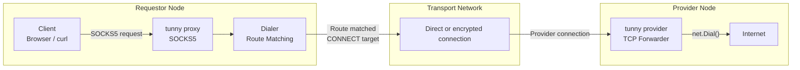
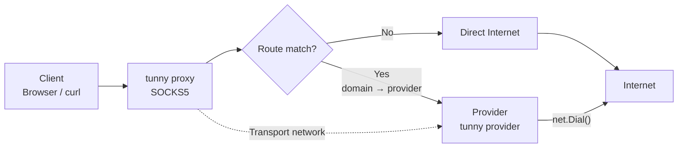
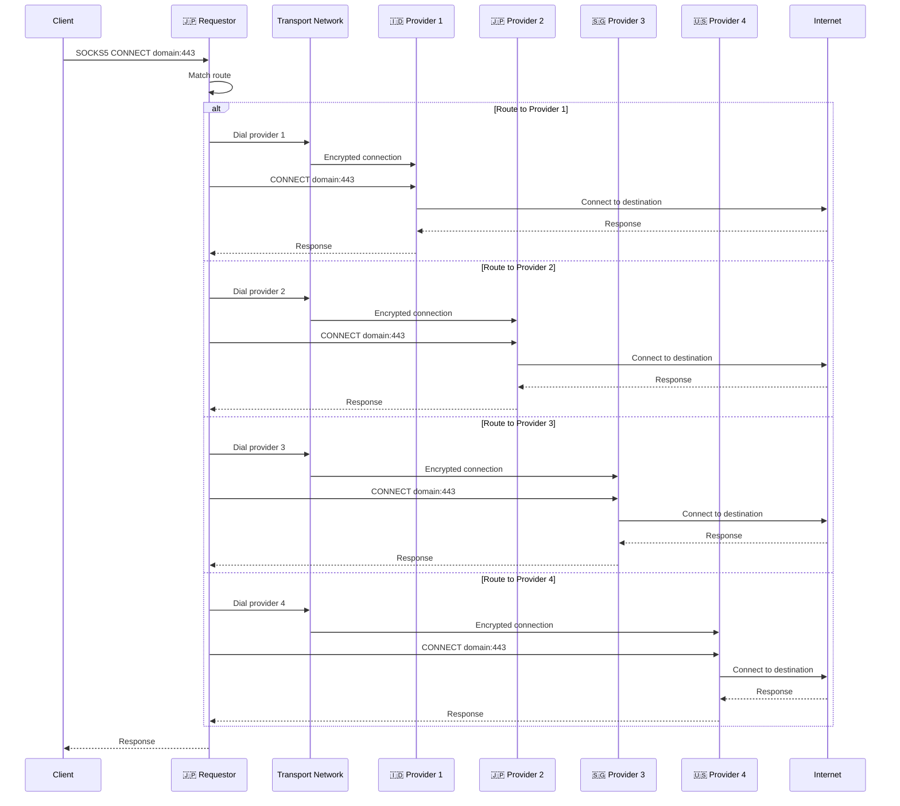
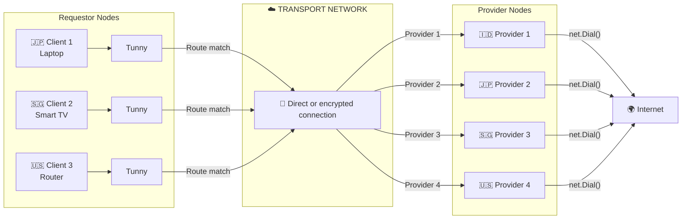

# tunny
Route selected internet traffic through trusted nodes using TUN and SOCKS5.

# How it works
Basically it's only proxying the request to provider (node - node) by translatin the host using Tailscale or Direct network

- The client sends traffic to the tunny tunnel or SOCKS5 proxy.
- Tunny checks whether the destination matches a configured route.
- Unmatched traffic uses the normal internet connection.
- Matched traffic is sent to the selected provider node.
- The provider connects to the destination and forwards the response back.
- Providers can connect through Tailscale or a direct network connection.

## Components

### Tunnel

The tunnel creates a local TUN interface. It catches traffic for configured
routes and forwards it to the selected provider.

See the [tunnel and provider example](example/tunnel-provider/README.md).

### Provider

The provider listens for connections from a tunnel or proxy. It connects to
the requested destination and sends data between the client and the internet.

### Proxy

The proxy is a local SOCKS5 server. Applications can use it when they do not
need a system-wide TUN interface.

See the [proxy and provider example](example/proxy-provider/README.md).

## Running as a daemon

See [DAEMON.md](DAEMON.md) for Tunny-managed `--daemon` mode and instructions
for creating `systemd` services on Linux or `launchd` services on macOS.

## Control plane and data plane

### Control plane

The control plane manages Tunny while it is running. It decides where traffic
should go and exposes the settings through gRPC and an HTTP JSON gateway.

It manages:

- Node names and network transport.
- Provider addresses.
- Hostname to provider routes.
- Tunnel, proxy, and provider listening settings.

The control plane API is defined in
[`control-plane/control.proto`](control-plane/control.proto).

The main operations are:

- `GetStatus` checks the running mode and uptime.
- `ListRoutes` lists configured routes.
- `SetRoute` adds or updates a route.
- `DeleteRoute` removes a route.

The gRPC server and JSON gateway are disabled by default. Enable them with:

```yaml
control_plane:
  enabled: true
  listen: 127.0.0.1:7071
  http_listen: 127.0.0.1:7072
```

### Data plane

The data plane carries the actual network traffic after the control plane has
selected a route:

- The tunnel reads packets from the TUN interface.
- The tunnel or proxy opens a connection to the selected provider.
- The provider connects to the destination service.
- Request and response data are copied between the client and destination.

In simple terms, the control plane chooses the path and the data plane moves
the bytes.

### Using the control plane

Start Tunny with the control plane enabled:

```bash
./tunny proxy -c config.yaml
```

The gRPC server listens on `127.0.0.1:7071`. The JSON gateway listens on
`127.0.0.1:7072`.

Use the JSON gateway with `curl`:

```bash
curl http://127.0.0.1:7072/v1/status
curl http://127.0.0.1:7072/v1/routes
curl -X POST http://127.0.0.1:7072/v1/routes \
  -H 'Content-Type: application/json' \
  -d '{"hostname":"example.com","provider":"japan"}'
curl -X DELETE http://127.0.0.1:7072/v1/routes/example.com
```

You can also use gRPC directly with `grpcurl`. The extra import path is
needed because the proto uses Google HTTP annotations:

```bash
GOOGLEAPIS="$(go env GOPATH)/pkg/mod/github.com/grpc-ecosystem/grpc-gateway@v1.16.0/third_party/googleapis"

grpcurl \
  -plaintext \
  -import-path . \
  -import-path "$GOOGLEAPIS" \
  -proto control-plane/control.proto \
  127.0.0.1:7071 \
  tunny.control.v1.ControlPlane/ListRoutes
```

For most use cases, the JSON gateway and `curl` are simpler.

The control plane manages settings. The tunnel, proxy, and provider continue
to carry the actual network traffic.

See the diagrams below



# Flowchart


# Sequence Diagram


# Network Topology


```topojson
{
  "type": "Topology",
  "objects": {
    "routes": {
      "type": "GeometryCollection",
      "geometries": [
        {
          "type": "LineString",
          "properties": {
            "name": "tunny tunnel",
            "from": "Japan",
            "to": "Indonesia"
          },
          "arcs": [0]
        }
      ]
    },
    "nodes": {
      "type": "GeometryCollection",
      "geometries": [
        {
          "type": "Point",
          "properties": {
            "name": "Japan",
            "role": "Requestor"
          },
          "coordinates": [139.6917, 35.6895]
        },
        {
          "type": "Point",
          "properties": {
            "name": "Indonesia",
            "role": "Provider"
          },
          "coordinates": [106.8456, -6.2088]
        }
      ]
    }
  },
  "arcs": [
    [
      [139.6917, 35.6895],
      [135, 28],
      [125, 18],
      [115, 8],
      [106.8456, -6.2088]
    ]
  ]
}
```

## Download and install

The easiest way to get Tunny is to download a release for your operating
system from the [GitHub Releases page](https://github.com/Aldiwildan77/tunny/releases).

After downloading a binary, rename it to `tunny`, make it executable on Unix
systems, and place it somewhere in your `PATH`:

```bash
chmod +x tunny
sudo mv tunny /usr/local/bin/tunny
```

You can also install the latest version with Go:

```bash
go install github.com/Aldiwildan77/tunny/cmd/tunny@latest
```

Or build it from the source code:

```bash
git clone https://github.com/Aldiwildan77/tunny.git
cd tunny
make build
```

The binary is created as `./tunny`. Run `tunny --help` to see the available
commands. Creating a TUN interface may require administrator privileges.
