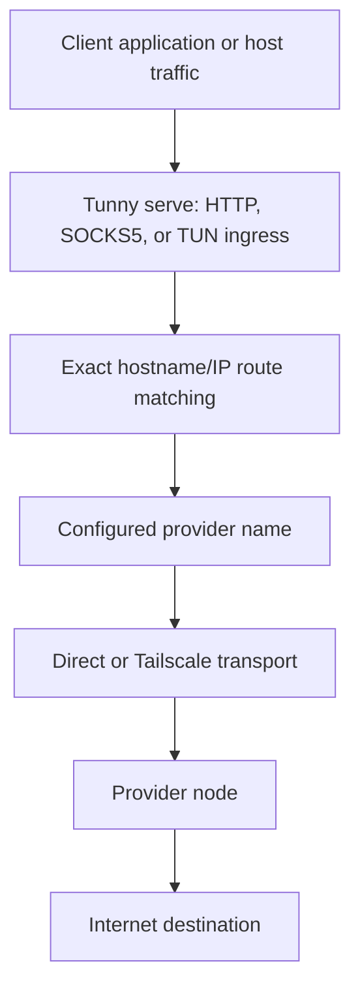
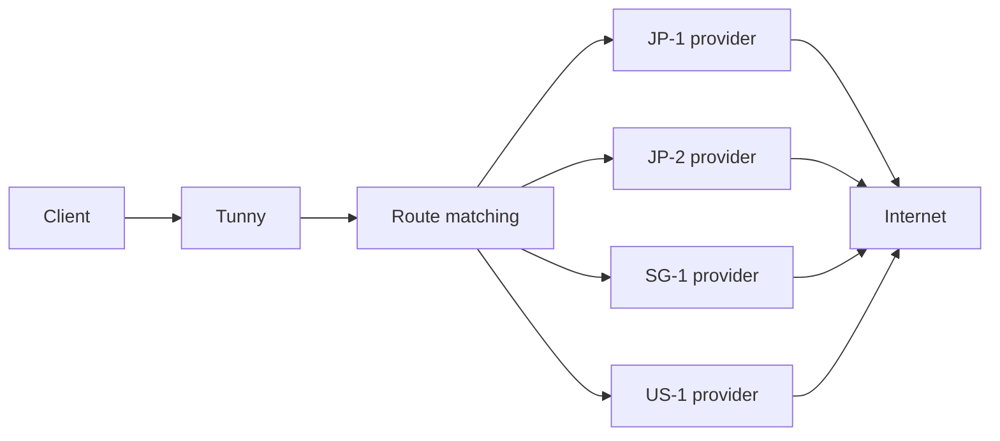
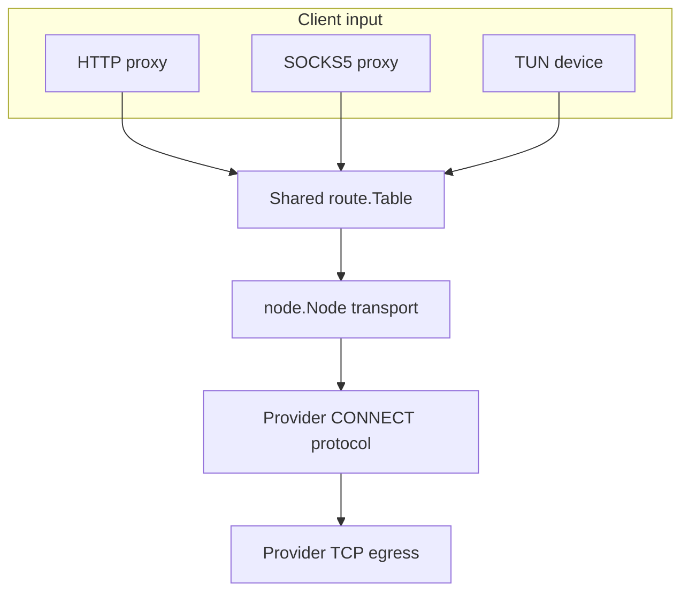

# Architecture

## Egress selection



The transport answers how Tunny reaches a provider. The route table answers
which configured provider handles a matched destination.

## Multi-node view



The current configuration selects one provider name per route. The diagram
shows the intended multi-node shape, not an implemented provider pool or
automatic failover algorithm.

## Data-plane layers



All serve entry modes share route matching and node transport. The `proxy`
and `tunnel` commands select one of these same ingress paths for compatibility.
The control plane is separate from this data path and changes routes or
reports status.

```text
Client application or host traffic
              |
              v
       Tunny serve
              |
              v
        Exact route matching
              |
              v
       Configured provider name
              |
              v
     Direct or Tailscale transport
              |
              v
            Provider
              |
              v
           Internet
```

The command starts by loading YAML configuration, constructing a `node.Node`, creating a `route.Table`, and starting the selected data-plane component. If enabled, the control plane shares that route table.

## Proxy path

The SOCKS5 server accepts a destination. The route-aware dialer checks the hostname or IP. A match causes the client node to dial the configured provider address and send `CONNECT host:port`. The provider dials the destination and forwards bytes. A miss uses the local network dialer.

## Tunnel path

The tunnel reads packets from a TUN device into a gVisor IPv4 stack. TCP and UDP forwarders derive the destination IP and use the same route-aware dialer. The current CLI creates a device named `utun` with MTU `1500`; the parsed `tunnel.interface` and `tunnel.mtu` settings are currently not used by the command.

## Provider path

The provider listens through the configured node. It accepts one newline-terminated `CONNECT destination` request, dials the destination with TCP, replies `OK`, and copies bytes in both directions.

## Control-plane path

When enabled, the server binds gRPC and HTTP listeners, registers the generated service, and serves status and route operations. It does not update provider addresses or listener settings.

## Connectivity versus egress

Tailscale or direct networking makes the provider reachable. Tunny's route table decides whether a destination uses that provider. BGP, ECMP, GeoDNS, and external health checks can influence reachability or surrounding infrastructure, but they are not core route-selection algorithms in this repository.
