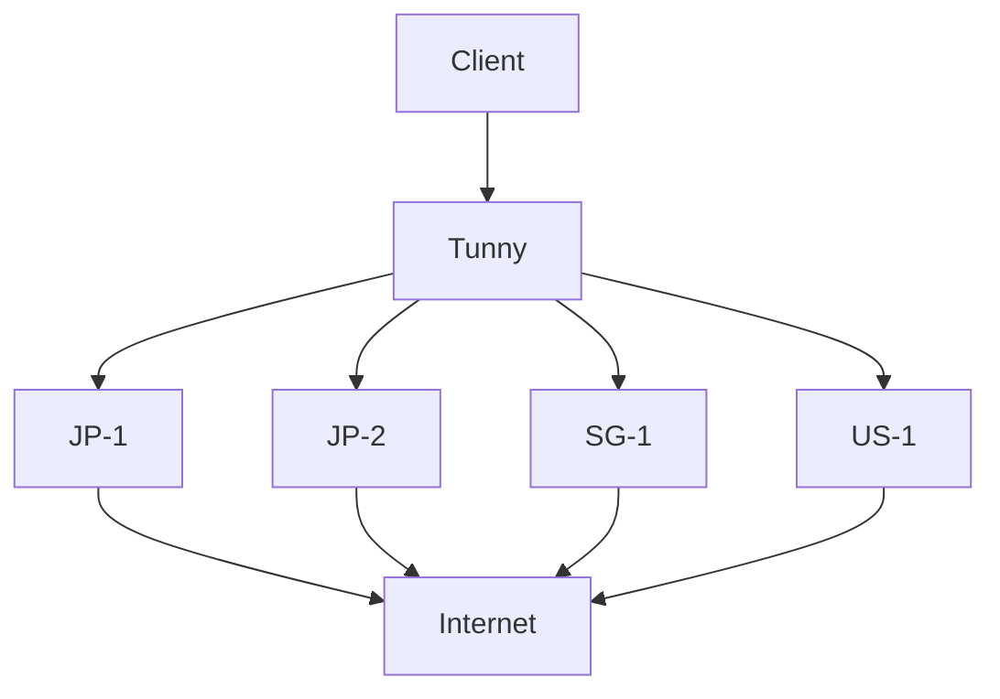

# Multi-node operation

Tunny can treat independently reachable machines as provider nodes:



```text
Client
  |
  v
Tunny
  |
  +---- JP-1
  +---- JP-2
  +---- SG-1
  +---- US-1
```

The current configuration maps each route to one provider name:

```yaml
providers:
  japan: 100.64.0.10:7070
  singapore: 100.64.0.20:7070

routes:
  service.example: japan
```

This is provider selection by explicit configuration. A route can also use an
ordered `route_policies` provider pool; health-aware failover applies to new
connections while latency, load, and geography remain outside the core route
table.

## Surrounding systems

- **Tailscale/WireGuard:** can make provider nodes reachable. Tunny can then select one of those reachable nodes for a destination.
- **BGP/ECMP:** can determine paths and next hops inside the network that carries traffic to providers.
- **gdnsd/GeoDNS:** can select DNS answers or provider endpoints outside Tunny's route table.
- **Health checking:** Tunny can actively check provider readiness with its
  internal PING/PONG protocol and exclude unhealthy providers from new
  failover connections.

The [BGP example](https://github.com/Aldiwildan77/tunny/tree/master/example/bgp-multi-node) combines FRR, gdnsd, and Tunny. It is a networking experiment with an IPv4-only setup and a separately run client, not a built-in BGP or load-balancing feature.

## Related projects

Projects such as anyhop and global-egress address related multi-exit or VPN-based workflows. Their primary abstractions differ from Tunny's intended model: Tunny's core configuration treats reachable machines as generic provider nodes and maps selected destinations to those providers. Similar systems may overlap in capability; this is a distinction of focus, not a claim of exclusivity.

Latency-aware selection, load-aware routing, geography-aware selection, and
Maglev-style distribution remain planned or experimental ideas outside the
current core behavior.
