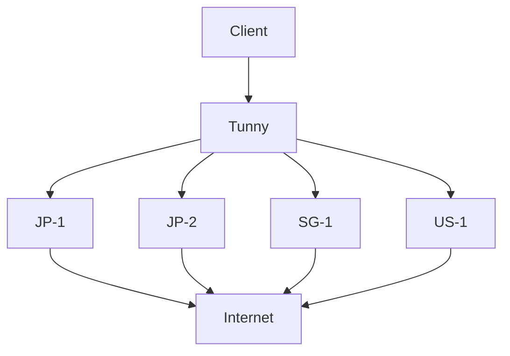

# Multi-node operation

Tunny can treat independently reachable machines as provider nodes:



```text
Client
  |
  v
Tunny
  |
  +---- JP-1
  +---- JP-2
  +---- SG-1
  +---- US-1
```

The current configuration maps each route to one provider name:

```yaml
providers:
  japan: 100.64.0.10:7070
  singapore: 100.64.0.20:7070

routes:
  service.example: japan
```

This is provider selection by explicit configuration, not a provider pool. Tunny does not currently choose among multiple providers based on health, latency, load, or geography, and it does not automatically fail over a route.

## Surrounding systems

- **Tailscale/WireGuard:** can make provider nodes reachable. Tunny can then select one of those reachable nodes for a destination.
- **BGP/ECMP:** can determine paths and next hops inside the network that carries traffic to providers.
- **gdnsd/GeoDNS:** can select DNS answers or provider endpoints outside Tunny's route table.
- **Health checking:** can monitor provider availability externally. Integrating those results into automatic Tunny provider selection is future work.

The [BGP example](../example/bgp-multi-node/README.md) combines FRR, gdnsd, and Tunny. It is a networking experiment with an IPv4-only setup and a separately run client, not a built-in BGP or load-balancing feature.

## Related projects

Projects such as anyhop and global-egress address related multi-exit or VPN-based workflows. Their primary abstractions differ from Tunny's intended model: Tunny's core configuration treats reachable machines as generic provider nodes and maps selected destinations to those providers. Similar systems may overlap in capability; this is a distinction of focus, not a claim of exclusivity.

Automatic provider pools, health-aware failover, latency-aware selection, load-aware routing, and Maglev-style distribution are planned or experimental ideas, not current core behavior.
